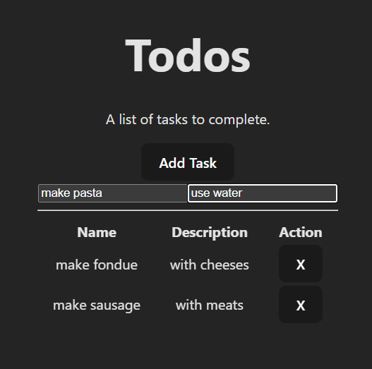

# Sandbox

This is a repository for basic web application development practice.
It is not perfect, simply a way to get started.

## Todos

Currently I have a simple todo application written in React, .NET Core, SQL.

This application uses NLog with plenty of example messages, feel free to extend it to database logging

### Descriptions

Main highlights of the project include dynamically registering services for dependency injection with

`(Program.cs) builder.Services.RegisterServices("Service");`

Demonstration of child-to-parent and parent-to-child communication within React

`(App.jsx) <Delete updated={populate} todoId={todo.taskId} />`

And loading of database configurations (keeping it outside of source control) via deserialization

`(DatabaseConnection.cs) SqlConnection(_connectionSettings.ConnectionString);`

> please disregard the naming conventions i mistakenly called them tasks setting up the database, "item" would be a better choice i think
